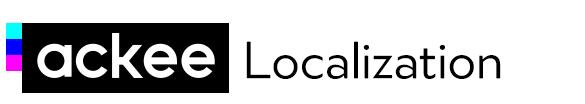

[](https://travis-ci.com/AckeeCZ/ACKLocalization)
[](http://cocoapods.org/pods/ACKLocalization)
[](http://cocoapods.org/pods/ACKLocalization)

# ACKLocalization

Simply localize your app with translations stored in Google Spreadsheet.

## Installation

### Cocoapods

1. Add **ACKLocalization** to your Podfile

```ruby
pod 'ACKLocalization`
```

2. Install pods
```bash
pod install
```

### Manually

Just download binary from Github release

## Usage

### Get your Google Spreadsheet identifier

1. your spreadsheet needs to be published - _File -> Publish to the web -> Publish_
2. here you will get a publish link which will have the format similar to this, your document ID is located after the first hyphen to the next slash
```
https://docs.google.com/spreadsheets/d/e/2PACX-<here_is_your_document_id>/pubhtml
```

_NOTE: Don't worry, we're thinking about simplifying this process_

### Calling ACKLocalization

Just call the binary with arguments that are appropriate for you.

```bash
Pods/ACKLocalization/Localization "<document_id>" "<name_of_column_with_key>" '<column_name_to_language_code_map>' "<destination_where_your_app_stores_localized_data>" "<name_of_localizable_file>" 
```

Well this code might be a bit confusing so let's give it an example.

### Example

We love to call **ACKLocalization** from Xcode (we have a separate aggregate target which calls the script) so I'll stick with that with this example.

#### Project structure

This is example folder structure of the project
```
|-Podfile
|-Project.xcodeproj
|-Project
|---Resources
|------en.lproj
|----------Localizable.strings
|------cs.lproj
|----------Localizable.strings
```

#### Spreadsheet structure

This is example structure of the spreadsheet with translations

| key_ios | EN    | CS   |
|---------|-------|------|
| hello   | Hello | Ahoj |

ACKLocalization also now supports plist files. Simply prefix the key with plist.NameOfPlist - please note that NameOfPlist is case-sensitive.

#### Example call

This is the example call of **ACKLocalization**
```
"$PROJECT_DIR/Pods/ACKLocalization/Localization" "<document_id>" "key_ios" '{"EN": "en", "CS": "cs"}' "$PROJECT_DIR/Project/Resources" "Localizable.strings" 
```

Let's have a look at the arguments

| Argument                         | Description                                             |
|----------------------------------|---------------------------------------------------------|
| _document_id_                    | Document ID of your spreadsheet                         |
| _key_ios_                        | Name of the column with keys                            |
| _{"EN":"en", "CS:"cs"}_          | Mapping between column names and your languages         |
| _$PROJECT_DIR/Project/Resources_ | Destination where your localizable resources are stored |
| _Localizable.strings_            | Name of your localizable strings file                   |

_NOTE: We're thinking about simplifying the call by using e.g. configuration file_

## Author

[Ackee](https://ackee.cz) team

## License

ACKLocalization is available under the MIT license. See the LICENSE file for more info.
