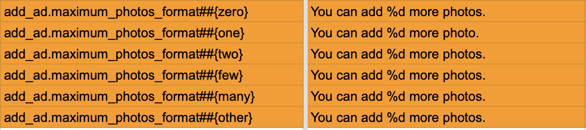

# ACKLocalization

Simply localize your app with translations stored in Google Spreadsheet.

## Installation

Preferred installation method is using [Mint](https://github.com/yonaskolb/Mint), just add it to your Mintfile

```
AckeeCZ/ACKLocalization
```

## Usage

You can use ACKLocalization in three ways:
1. [application default credentials](#application-default-credentials)
2. safer and recommended [use with Service Account](#use-with-service-account)
3. [use with API key](#use-with-api-key)

### Application default credentials (ADC)

For authorization to Google Spreadsheet we recommend using [Application default credentials](https://cloud.google.com/docs/authentication/application-default-credentials). This way you can safely authorize locally using your personal Google account and use a service account in CI environment.

To setup application default credentials you need to install gcloud CLI utility and run

```
gcloud auth application-default login --billing-project <project_id> --scopes https://www.googleapis.com/auth/spreadsheets.readonly,https://www.googleapis.com/auth/cloud-platform,https://www.googleapis.com/auth/sqlservice.login,https://www.googleapis.com/auth/userinfo.email,openid
```

You need to add additional scope `https://www.googleapis.com/auth/spreadsheets.readonly` that will allow your ADC to read spreadsheet API on your behalf.

As Spreadsheet API is [Client-based](https://cloud.google.com/docs/quotas/quota-project#project-client-based) you need to provide a quota project. Spreadsheet API is free so you do not need to worry about that. The project just needs to have Spreadsheet API enabled.

### Use with Service Account

This method is safe in the way that you can fully control who has access to your spreadsheet. You create a service account, invite it as viewer to your spreadsheet and you're ready to go.

#### Create a Service Account

You need to have a Google project in [Google Dev console](https://console.developers.google.com), there you go to Credentials ➡️ create credentials ➡️ service account key. Then you need to enable Google Sheets API in the console.

#### Invite Service Account to your spreadsheet

The Service Account has associated email address, you need to invited that address to your spreadsheet, so it is available to read the document.

Now you can skip to [getting your spreadsheet identifier](#get-your-google-spreadsheet-identifier)

### Use with API key

You need to have a Google project in [Google Dev console](https://console.developers.google.com), there you go to Credentials ➡️ create credentials ➡️ API Key. This will create unrestricted API key, we recommend to restrict it as much as possible - application restrictions are unluckily not possible to use - maybe if you intend to run the script on CI, then you can restrict it to certain IPs. What you can do is to restrict the API key to Google Sheets API (you might need to enable this API first in the console).

### Get your Google Spreadsheet identifier

You get the spreadsheet identifier from its URL:
```
https://docs.google.com/spreadsheets/d/<YOUR_SPREADSHEET_ID>/edit#gid=0
```

### Now you can build your configuration file

The file is named `localization.json`. This is how example file looks like, you can find the Swift representation [here](Sources/ACKLocalizationCore/Model/Configuration.swift):

```json
{
    "defaultFileName": "Localizable",
    "destinations": {
        "Localizable": "Framework/Resources",
        "InfoPlist": "App/Resources"
    },
    "keyColumnName": "iOS",
    "languageMapping": {
        "CZ": "cs"
    },
    "serviceAccount": "Resources/ServiceAccount.json",
    "spreadsheetID": "<GOOGLE_SPREADSHEET_ID>",
}
```

Attributes documentation:

| Name | Required | Note |
| ---- | -------- | ---- |
| `defaultFileName` | ✅ | Name of default strings(dict) file |
| `destinations` | ✅ | Dictionary of destinations for all generated files (at least entry with  `defaultFileName` is required), if you use `plist.<filename>.` prefix in your sheet, you might wanna add those entries as well, otherwise they will be generated alongside the default file |
| `keyColumnName` | ✅ | Name of column that contains keys to be localized |
| `languageMapping` | ✅ | Mapping of language column names to app languages, you specify how columns in spreasheet should be mapped to app languages |
| `apiKey` | ❌ | API key that will be used to communicate with Google Sheets API, `apiKey` or `serviceAccount` has to be provided |
| `serviceAccount` | ❌ | Path to service account file that will be used to access spreadsheet, `apiKey` or `serviceAccount` has to be provided |
| `spreadsheetID` | ✅ | Identifier of spreadsheet that should be downloaded |
| `spreadsheetTabName` | ❌ | Name of spreadsheet tab to be fetched, if nothing is specified, we will use the first tab in spreadsheet |

The file has to be in the same directory where you call ACKLocalization.

To be able to communicate with Google Sheets API, you need to provide either `apiKey` or `serviceAccount` parameter or [use environment variable](#environment-variables). If both are provided, then `serviceAccount` will be used.

### Environment variables

Do you want to share secrets across multiple projects, or do you not want to keep secrets in the project repository? We have the solution for you. Just set one of the environment variables below.

`ACKLOCALIZATION_SERVICE_ACCOUNT_PATH` - Path to service account file that will be used to access spreadsheet
`ACKLOCALIZATION_API_KEY` - API key that will be used to communicate with Google Sheets API

`apiKey` or `serviceAccount` defined in `localization.json` have higher priority than environment values.
If both are provided then `ACKLOCALIZATION_SERVICE_ACCOUNT_PATH` will be used. 

### Calling ACKLocalization

Just call the binary, remember that the configuration file has to be in the same directory where you call ACKLocalization.

### Example

We love to call **ACKLocalization** from Xcode (we have a separate aggregate target which calls the script) so I'll stick with that with this example.

#### Project structure

This is example folder structure of the project
```
|-localization.json
|-Project.xcodeproj
|-ServiceAccount.json
|-App
|---Resources
|------en.lproj
|----------InfoPlist.strings
|------cs.lproj
|----------InfoPlist.strings
|-Framework
|---Resources
|------en.lproj
|----------Localizable.strings
|----------Localizable.stringsDict
|------cs.lproj
|----------Localizable.strings
|----------Localizable.stringsDict
```

#### Spreadsheet structure

This is example structure of the spreadsheet with translations

| key_ios | EN    | CS   |
|---------|-------|------|
| hello   | Hello | Ahoj |
| plist.InfoPlist.NSCameraUsageDescription | Cammera usage description | Popis využití kamery |

#### Example config file for this case would be

This is the example config file:
```json
{
    "defaultFileName": "Localizable",
    "destinations": {
        "Localizable": "Framework/Resources",
        "InfoPlist": "App/Resources"
    },
    "keyColumnName": "key_ios",
    "languageMapping": {
        "CS": "cs",
        "EN": "en"
    },
    "serviceAccount": "Resources/ServiceAccount.json",
    "spreadsheetID": "<GOOGLE_SPREADSHEET_ID>",
    "spreadsheetTabName": "Localizations"
}
```

### Plist keys

ACKLocalization supports localizing plist files. Simply prefix the key with `plist.InfoPlist`, where `InfoPlist` is the name of plist you need to localize and ACKLocalization will automatically generate respective `InfoPlist.strings` files. Please note that `InfoPlist` name is case-sensitive.

Example keys:

```
plist.InfoPlist.NSPhotoLibraryAddUsageDescription
plist.InfoPlist.NSUserTrackingUsageDescription
```

`InfoPlist.strings` result:

```
"NSPhotoLibraryAddUsageDescription" = "Your photo library usage message.";
"NSUserTrackingUsageDescription" = "Your tracking permission message.";
```

### Plural keys

To add plurals to the spreadsheet, you need to specify the translation key and the plural type using the following [native convention](https://developer.apple.com/documentation/xcode/localizing-strings-that-contain-plurals):

```
translation.key##{zero}
translation.key##{one}
translation.key##{two}
translation.key##{few}
translation.key##{many}
translation.key##{other}
```

This will be automatically generated into `Localizable.stringsDict` and the key won't be presented in `Localizable.strings`.

Example:



## Author

[Ackee](https://ackee.cz) team

## License

ACKLocalization is available under the MIT license. See the LICENSE file for more info.
